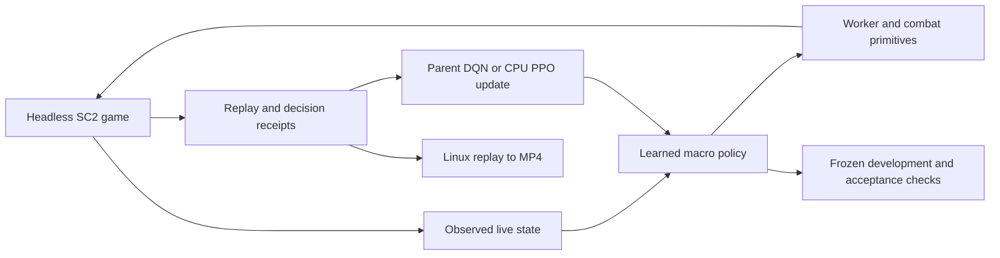

# SC2 Void Bot

Headless StarCraft II computer-opponent experiments on Linux. The current scripted
bots are baselines. The Terran macro learner is an explicit first experiment;
its observation/action representation is not the project's final design.

**Future learning direction:** [Terran learning roadmap](docs/learning-roadmap.md)
— broad gameplay controls, professional replay imitation, learned micro and RL.
Training remains paused; the roadmap is not an instruction to launch jobs.

## Setup

Python 3.12 and uv are used locally. Install the locked Python dependencies:

```bash
uv sync --frozen
uv run python -m unittest discover -s tests -v
```

No game installation is downloaded by these commands. By default the code finds the
existing sibling `../game/SC2.4.10/StarCraftII`, including from a Git worktree. For
another installation, set the path before running:

```bash
export SC2PATH=/absolute/path/to/StarCraftII
```

The game directory must contain `Versions` and `Maps`. Local Linux experiments use
SC2 4.10, build 75689. Maps and the replay's game build must match for playback.

## Scripted comparisons

Run from the repository/worktree root:

```bash
uv run python -m src.runner --bot reaper --race Zerg --difficulty Hard --map Simple64 --games 1 --workers 1 --game-seconds 60 --dev --output logs/smoke
uv run python -m src.runner --bot reaper --race Terran --build Rush --difficulty Hard --map Simple64 --games 4 --workers 4 --seed 100 --output logs/comparison
```

`python src/runner.py` is also supported. `--help` lists available bots and options.
Defaults are non-realtime simulation, step 8, four workers, a 1,200-game-second
limit and a 300-wall-second limit. Each game has a unique replay and JSON receipt.
A cutoff Tie is recorded as `truncated`; worker failures/timeouts are separate
statuses and make the command exit nonzero. The supervisor cleans only its own
worker's process group, including game descendants.

`--dev` records score telemetry in Parquet under `logs/`. Logging buffers rows and
converts them once at game end. These are our bot's observations, not omniscient
opponent statistics. For old telemetry plots:

```bash
uv run python -m src.processing.plotter
```

## Layout and preserved references

- `src/runner.py`, `src/runtime.py`, `src/path.py`: commands, supervision, installation discovery.
- `src/bots/`, `src/examples/`: existing scripted strategies/examples, with original attribution.
- `src/common/`: score telemetry base class.
- `src/processing/`: analysis and replay tools.
- `tests/`: standard-library unittest tests; no extra test framework is required.
- `logs/`, `replays/`: ignored run artifacts; keep them outside Git.
- `docs/legacy/`: preserved old resource plot and score-column snapshot.
- `docs/performance-baseline.md`: measurements, including three scripted losses against Hard.
- `docs/terran-rl-experiment.md`: intended experiment and acceptance evidence.

The sibling `SC2RL` is a separate Protoss PPO tutorial with old models and logs.
`pysc2` and `sharpy-starter-bot` are separate reference projects. None is required
by this runner. The sibling `environment.sh` and `requirements.txt` are legacy
setup files; this project uses SC2PATH discovery, pyproject.toml and uv.lock.
They, game data, old models and replays have been preserved.

## Replay proof and remaining work

The audit successfully replayed a saved game using the installed OSMesa library
and exported RGB frames to an MP4 using the already-installed ffmpeg. The diagnostic
video and receipts live in the implementation worktree's `logs/audit/`.
Reusable training and replay-export commands are below.
The scripted-bot examples do not establish learned strength. The retained richer PPO checkpoint won 12 of 30 Hard development games,
including all three races. Reliable Hard strength remains unmet; see
[experiment results](docs/experiment-results.md).

The separately reviewed resource-collection curriculum completed 32 training
games and improved collection by 10.56% on eight fresh paired cases. It learned
worker production and expansion but produced no army. Its full-game Hard transfer
failed (parent 5/12 wins, candidate 0/12), so it is closed without promotion; see the
[collection results](docs/superpowers/plans/2026-10-05-resource-collection-learning-results.md).

The isolated production-input comparison completed with verified training and replay
checks, but regressed frozen Medium wins: parent 22/30, control 21/30, sensory 6/30.
It is closed without promotion. See the
[production-input experiment ledger](docs/superpowers/plans/2026-10-05-production-sensory-learning.md).
An exact offline replay then found that fresh Adam clocks for the appended inputs
reduce excess first-update policy drift by 78%. The corresponding fixed continuation
still regressed: 7/30 frozen Medium wins, so it is closed without promotion.
See the [optimizer diagnostic](docs/superpowers/plans/2026-10-05-production-input-update-replay.md).
The [fresh-clock experiment](docs/superpowers/plans/2026-10-05-production-input-fresh-adam.md)
records the completed training, audits and a Linux replay video.

## Terran learning experiment

The NumPy game policy consumes live economy, production, army, and observed-enemy features. Enemy input comes
from SC2 observations, which can include last-scouted snapshots under fog.
Army counts include every trainable combat unit and its transformed forms.
Checkpoints from the earlier count schema require an explicit recorded migration
or a matching older checkout; the loader rejects silent schema changes.
It chooses atomic build/train/tech/expand/attack/retreat actions. There is no scripted
build order or fixed army mix. Gathering, placement, depot lowering, MULE execution,
defense and combat execution are primitives. The main CLI now uses the tested
spatial experiment: observed unit identities and an 8x8 map grid of health,
weapons, flying, structures, detectors, cloak, visibility and snapshots. Its
5,460 features and 27 actions are still an experimental representation.
Compact checkpoints require the matching earlier Git checkout (for example
`8c3c697`); current loaders reject their incompatible schema/settings. The retained
`combat-kills-v1` PPO checkpoints use the current CLI directly. See the
[current experiment status](docs/experiment-results.md#current-development-status).

```bash
uv run python -m src.rl.train --episodes 2 --workers 4 --macro-seconds 1 --game-seconds 120 --checkpoint logs/my-run/policy.npz --output logs/my-run
uv run python -m src.rl.train --episodes 20 --workers 4 --checkpoint logs/my-run/policy.npz --output logs/my-run
uv run python -m src.rl.train --mode evaluate --episodes 30 --seed 50000 --builds Rush Timing Power Macro Air --checkpoint logs/my-run/frozen.npz --output logs/my-evaluation
```

For evaluation, first copy the desired checkpoint to `frozen.npz` and retain that
snapshot. Training resumes an existing checkpoint including network/target weights,
optimizer, experience, RNG and episode count. A separate attempt cursor advances training seeds/opponents on
resume, including mixed-success batches; evaluation defaults to seeds starting at 10000. Use a new seed bank for final
acceptance after inspecting development evaluations. `--maps`, `--races`, `--builds`
and `--difficulty` select computer opponents; `--macro-seconds` controls decision
cadence. Army distance from home/enemy spawn and time since the last stance change
help distinguish movement even when enemies are hidden. Resume infers the stored cadence and rejects a changed training cadence.
Legacy checkpoints lacking this metadata require their known original
`--legacy-macro-seconds` value. New runs default to five seconds; the one-second
experiment above gives the atomic actions more production opportunities. Each macro action attempts one operation, so slower cadence also limits
production throughput. Do not run multiple trainers against the same checkpoint. Each training batch also
retains a unique `.behavior.npz` file in its output directory. A game receipt
links `behavior_checkpoint` and its SHA-256 to the exact input model. These
snapshots can be evaluated later even after the canonical model advances;
evaluation, sampled PPO evaluation and random comparisons use the supplied frozen file directly.

Actions are legal at the observed resource/tech level. A logged `executed` value
means a command was issued successfully by the Python client; SC2 may still reject
it or construction may subsequently fail. Inspect replay/state changes to establish
actual completion. The logs contain chosen actions, legal masks, snapshots and reward
components. The current capacity potential uses .5 per worker, .2 per army supply and 2 per
base, capped by the observation encoder. Spending resources alone earns no reward;
terminal wins receive +100, defeats/cutoffs receive zero, and newly killed
enemy mineral-plus-gas value contributes value/100 once per increment. Our
losses remain diagnostics. Checkpoints identify their reward objective,
and incompatible or unknown objectives are rejected for training resume.
Replay learning uses up to 32 macro rewards with the actual bootstrap discount,
stopping before a later nongreedy action from the frozen worker policy. New-checkpoint discounting accounts for macro cadence. The declared finite match horizon is observed; time-limit ties end the learning
episode with zero final potential and no bootstrap, while the game receipt
keeps them distinct from defeats.

Four workers collect games from a shared frozen behavior checkpoint by default.
The parent merges successful games in launch order and learns from their experience;
worker weights and optimizer state never replace the parent. Set `--workers 1` for
serial collection. A clean interruption stops owned game workers and preserves the
last promoted checkpoint.

For quieter Linux runs, prefix the command with `python tools/low_load.py`
and use `--workers 4`. The wrapper restricts this job and its descendants to
eight allowed logical CPUs, adds nice +10, limits numerical-library threads
to one, hides CUDA devices, and requests software OpenGL. On this32-thread
machine the CPU affinity bounds this task to 25% of logical CPU capacity.
The currently authorized whole-machine CPU ceiling is 80%; it is a ceiling,
not a target. The isolated collection experiment also samples aggregate CPU
and cancels its owned workers above that ceiling. Other applications remain
independent; monitor whole-machine load during ordinary CLI runs. Example:

```bash
.venv/bin/python tools/low_load.py .venv/bin/python -B -m src.rl.train --mode evaluate --checkpoint .worktrees/terran-rl/logs/ppo-combat-kills/frozen-easy40.npz --episodes 4 --workers 4 --difficulty Hard --maps Simple64 --builds Air --races Protoss --seed 20013 --macro-seconds 1 --output logs/quiet-hard-check
```

Each game writes a replay, JSON receipt and JSONL decisions. Receipts identify source
and map hashes, game build, action RNG seed and behavior checkpoint hash. Failed/timed-out games
do not promote a candidate checkpoint. Training updates occur in the parent only after successful
game execution; frozen evaluation performs no updates and checks the checkpoint hash.
A smoke-test update is not evidence of a strong policy. The initial batches failed against Hard. An economic-potential probe subsequently
won one of six frozen Hard games against Protoss Rush; a separate capacity probe
won one of six against Terran Macro. Broader economic-probe evaluation won only
one of thirty games. These are preliminary results;
see [the experiment report](docs/experiment-results.md) for progress.

The execution and learning loop is:



## PPO comparison using the existing Torch runtime

The default learner remains DQN for dependency-free experiments. The retained
Hard wins use PPO, which reuses Torch already
installed in the sibling SC2RL environment, without installing it in game workers:

```bash
uv run python -m src.rl.train --algorithm ppo --torch-python /home/sam/repos/sc2-repos/SC2RL/.venv/bin/python --macro-seconds 1 --episodes 4 --game-seconds 180 --difficulty VeryEasy --checkpoint logs/my-ppo/policy.npz --output logs/my-ppo
uv run python -m src.rl.train --torch-python /home/sam/repos/sc2-repos/SC2RL/.venv/bin/python --episodes 20 --difficulty VeryEasy --checkpoint logs/my-ppo/policy.npz --output logs/my-ppo
```

On this machine, the retained 12/30 development checkpoint can be evaluated from
the repository root with the current source:

```bash
uv run python -m src.rl.train --mode evaluate --checkpoint .worktrees/terran-rl/logs/ppo-combat-kills/frozen-easy40.npz --episodes 30 --workers 4 --difficulty Hard --maps Simple64 TritonLE --builds Rush Timing Power Macro Air --seed 20000 --macro-seconds 1 --output logs/retained-hard-check
```

This repeats development cases, not final acceptance. The checkpoint is a retained
local artifact outside Git. To continue it, copy it to a new experiment path and
use that copy with the training command and existing Torch interpreter above.

Keep the virtualenv interpreter path; resolving its symlink bypasses that
environment. The helper disables bytecode writes and leaves the sibling runtime
unchanged. Saved models infer and validate their algorithm. PPO uses a masked
categorical actor and value head, normalized combat-kills rewards (.01 scale),
finite-episode returns (GAE lambda 1),
and one clipped update over each batch's valid complete game trajectories.
Rollouts are discarded after updating; they are not DQN replay experience.

Game workers and frozen inference use NumPy. Only CPU gradient updates launch the
existing Torch interpreter. Receipts identify the backend/version, source, shared
rollout batch and update count. Helper failures/timeouts preserve the canonical
checkpoint. Frozen `--mode evaluate` uses greedy actor choices; `--mode sample` samples the learned PPO distribution with a reproducible seed per game. Both preserve checkpoint bytes and require no Torch
backend; successful smoke updates do not establish Hard strength.

## Watch a saved replay on Linux

The installed OSMesa library and ffmpeg are sufficient here; no VM is needed for MP4
viewing. Export after training so rendering does not consume simulation resources:

```bash
uv run python -m src.processing.replay_video /absolute/path/game.SC2Replay --map-file /absolute/path/to/Simple64.SC2Map --output logs/game.mp4 --camera overview --step 22 --fps 4
uv run python -m src.processing.replay_plotter logs/game.frames.json --output logs/game-resources.png
```

Choose `--camera base` for a closer view, `--player 2` for the computer's perspective,
and `--omniscient` to remove fog during replay viewing only. `--max-frames` and
`--wall-seconds` bound export; the receipt declares when the frame limit was reached.
At step 22 and 4 fps the video runs about 3.9 times game speed. Defaults (step 3,
8 fps) approximate normal speed. Supply `--library` for another installed OSMesa path.
The exporter checks the replay's exact SC2 build and fails if it is unavailable.
It streams RGB frames to ffmpeg and saves per-frame resource observations for plots.

MP4 is portable viewing, not an interactive SC2 client. For interactive Windows
playback, retain the original replay and matching map, install SC2 with access to
that replay's build (these local runs require 4.10/build 75689), copy the map to its
Maps directory, copy the replay to Documents/StarCraft II/Replays, and open it from
the game's replay browser. A current client without the old build/map data may
fail. This Windows route has not been verified on a Windows machine; Linux MP4 export
has been verified locally.
