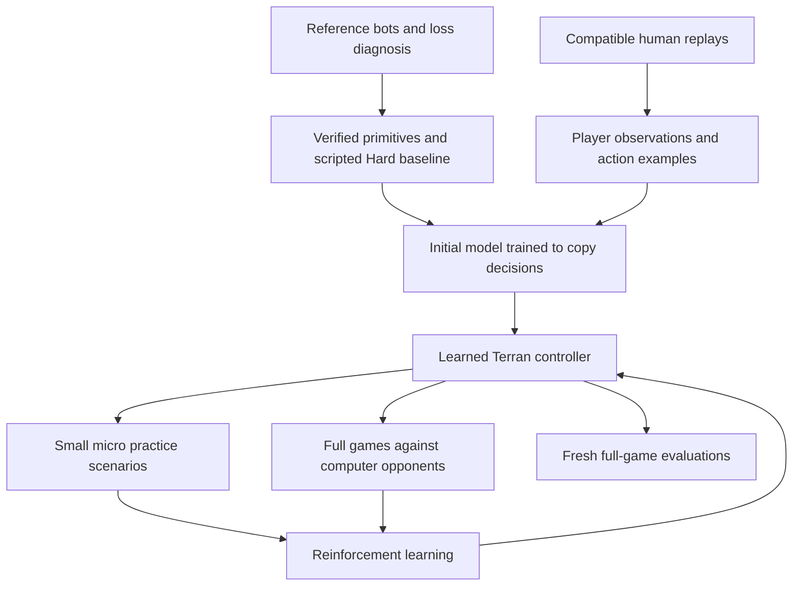

# Terran learning roadmap: reliable primitives, human examples, then reinforcement learning

Agreed direction recorded October 5, 2026. **Execution is active:** the user
subsequently instructed the agent to complete this roadmap. Current implementation
and experiment evidence are recorded in [the execution ledger](learning-execution.md).
A concise [current status and resumption guide](current-learning-status.md) identifies
the active phase, verified data and remaining requirements.
The original goal remains reliable wins against computer opponents of
all races and strategies, starting with Hard and progressing to higher difficulties.
Bot-ladder competition is a later goal.

This roadmap supersedes the narrow 27-action macro experiment as the future
architecture. Preserve that experiment and its evidence as baselines.

## October 6 reset: establish reliable primitives first

The user explicitly redirected the work after repeated losses: pause imitation
and RL training, understand the losses, and establish reliable primitives using
established open-source bots as engineering references. This supersedes earlier
instructions against scripted strategic goals during the current baseline phase.
Scripted attacking and combat micro are explicitly in scope. A scripted Hard win
is an execution baseline, not completion of the learned-policy goal.

1. Diagnose saved losses before another training batch. Measure mining and idle
   workers, resource income and floating resources, supply blocks, production
   downtime, failed construction, army movement, engagements and losses. Separate
   observed failures from suspected causes. Existing games already show zero
   victories and a controller that attacks visible enemies but does not send an
   army toward the opponent's base; worker-production starvation also needs checking.
2. Inspect maintained open-source Terran bots and their actual command paths.
   Record source versions, licenses and relevant code before adapting behavior.
   Prefer a working, modest baseline over assembling an untested collection of
   features. Do not assume competition rank implies strength on our engine.
3. Establish resource gathering and saturation, worker production, supply,
   construction and placement, army production, scouting, army movement and
   attacking. Combat primitives include target selection, movement during fights,
   retreat and appropriate unit abilities. Verify commands produce their intended
   effects in native games, including under attack; command acceptance alone is
   insufficient. Use player-visible information and respect fog of war.
4. Prove the scripted baseline against Hard opponents of all races, using declared
   maps, seeds and opponent strategies. Use the existing 21/30 initial Hard gate
   below, report each race, include losses and timeouts, and inspect failures.
   Fix execution defects before spending more compute on learning.
5. Return to professional replay imitation with the verified execution layer.
   Keep broad raw controls available; primitives must not permanently reduce the
   model to a fixed menu of build orders. Make explicit which decisions are learned
   and which details the primitives execute. Verify useful native imitation.
6. Only then resume RL, including micro sandbox learning and full-game transfer,
   to improve the learned controller against Hard and higher difficulties.

For a construction primitive, the model can decide what to build and where;
the executor selects an available worker, checks placement and follows through.
For combat, scripted micro supplies the initial working baseline while learned
control remains a later target. Keep separate results for scripted, imitation
and RL controllers. Preserve the existing replay workflow and CPU-only limits.

## Where we stand

At roadmap creation, headless game execution, bounded worker supervision, checkpointing and replay
capture existed. Linux replay-to-video export was previously demonstrated. The
retained macro learner won 12/30 and 13/30 games in development Hard panels; that
is progress, but does not establish reliable strength. Its scripted micro and
small macro vocabulary constrain what it can learn. Human-replay imitation and
learned micro were still planned at that snapshot. Their implementation and
failed live competence/transfer gates are now documented in the execution ledger.

See the [paused status](project-status-2026-10-05.md),
[experiment results](experiment-results.md), and
[prior literature review](../reports/SC2%20RL%20practical%20improvements.md).
Treat those records as historical evidence, not instructions to repeat every
experiment. Future agents should verify the current checkout and running jobs
before acting.

## The intended learning process

1. Establish and verify reliable execution primitives and a strong scripted baseline.
2. Give the model the gameplay controls and information needed to play Terran.
3. Turn strong human replays into examples of what a player knew and did.
4. Train the model to make similar decisions, and check that it can actually play.
5. Let it learn beyond those examples through games and focused micro practice.

Human examples give it a useful starting point. They must not permanently limit
its tactics, reaction speed or ability to control several places at once. The
imitation-then-RL sequence has precedent in
[AlphaStar](https://deepmind.google/blog/alphastar-mastering-the-real-time-strategy-game-starcraft-ii/),
but this project should not promise AlphaStar results on a desktop budget.

Both practice scenarios and full games should use the same observation and
command definitions. Macro decisions and unit control can have different update
rates, but must work together.

## 1. Replace the restrictive controls and improve perception

**Target: all Terran gameplay actions available through the supported game API.**
This means choosing an ability or command, which units execute it, its target
(unit or position where applicable), whether it is queued, and when to act again.
It must support independent commands for different units in the same game step.
Do not enumerate every combination as a separate button.

Make a coverage inventory against the installed engine's abilities. Include
construction and placement, production, research, worker assignments, repairs,
rallies, cancellation, movement, attacks, targeting, stop/hold/patrol, lift/land,
add-ons, transformations, spells, transport loading/unloading and scouting.
Report unsupported abilities explicitly. Only mask commands for real game rules
such as prerequisites, resources, target types and cooldowns. A preferred build
order is not a legality rule.

Use raw gameplay commands rather than reproducing mouse clicks. Blizzard's
[raw API](https://github.com/Blizzard/s2client-proto/blob/master/docs/protocol.md)
exposes visible units and unit-tag commands without requiring screen selection.
Human-equivalent gameplay capability does not require recreating every UI gesture.

Expand observations alongside controls:

- Individual visible units and structures: type, position, health, shields,
  energy, cooldowns and available orders where exposed to the player.
- Economy, production, upgrades, supply, terrain, pathing and visibility.
- Memory of previous scouting, with age and uncertainty; an enemy last seen at a
  position must not silently become a currently visible enemy.
- Recent actions and game history, so the model can coordinate a plan over time.

The actor may attend to **all information legitimately available across the map**
at once, including simultaneous visible battles. Fog of war still applies.
Replay extraction and debug scenarios must not leak hidden enemy state into its
inputs. Screen-only vision is not required, but aggregate end-game statistics
alone are insufficient.

**Check:** exercise representative command families in real engine fixtures;
verify targets, queues and resulting orders. Trace who selected each decision.
Temporary scripts must be named and measurable, not hidden replacements for
learned macro or micro. Keep the old 27-action model runnable as a baseline.

## 2. Prove human replay extraction before building a large collection

Start with a handful of strong Terran replays. Clem is one possible source;
include several strong players and styles rather than assuming one player's
habits cover every situation. Expand across Terran, Protoss and Zerg opponents,
openings, maps, defensive situations and longer games. Wins and losses can both
contain useful decisions; retain outcome and quality labels.

**First obstacle: version compatibility.** The local Linux game is SC2 4.10,
build 75689. Modern professional replays may require unavailable builds or maps.
Replay metadata parsing alone does not demonstrate that we can reconstruct game
observations. Prove actual replay stepping with the matching engine and map
before downloading a large collection. Start with compatible older games if
necessary; document any proposed upgrade separately.

The [PySC2 documentation](https://github.com/google-deepmind/pysc2) describes
replay and map setup. Linux replay dependencies need deliberate handling; do not
assume modern replays will run in the existing installation.

For each example, reconstruct what that player could know **before** a command,
and retain the command's units, target, queue setting and timing. Distinguish
commands issued from commands successfully executed. Replays show actions, not
the player's reasoning. Audit a few short sequences against replay events and
resulting unit orders.

Do not silently convert unsupported commands to “wait,” discard whole classes of
behavior, or collapse a burst of independent orders into one macro button. Track
coverage and extraction failures. Store replay provenance, version, map, player,
race, outcome and extractor version. Check source terms before bulk acquisition.

Split training and evaluation by whole game, avoiding duplicate replays and
near-identical tournament series leaking across sets. Include held-out players
or events where feasible. Neighboring frames from one game are not independent
test examples.

**Check:** a small, auditable dataset with reconstructed player observations and
commands that our controller can represent. Only then scale collection.

## 3. Teach the model to copy useful decisions

Train it to predict the recorded actions from the recorded observations and
history. This is what “imitation learning” means here: show it many examples of
“in this situation, this player issued these commands.”

Use separate outputs for command, units, target, queue and timing as appropriate.
The exact network is an implementation choice to settle after the extraction
prototype, not a reason to copy an enormous research architecture immediately.
It must accommodate individual units, spatial information and history.

Measure held-out command and argument quality, but also run complete games.
Correct predictions on replay frames do not prove the model can recover when
its own decisions create an unfamiliar position. Record obvious failures:
supply blocks, idle production, unusable commands, missing scouting, broken
combat or inability to finish a game. Fix representation/execution failures
before spending more time collecting RL games.

Human timings are a useful initial example, **not a permanent speed ceiling**.
Human mouse selection and camera movement should not become compulsory gameplay
actions. Temporary scripted assistance must be reported so wins are attributed
correctly.

**Check:** a saved imitation model that completes games and demonstrates useful
macro and control in live situations. Compare it with the existing learner and
simple scripted baselines; report its actual limitations before RL.

## 4. Build a small micro practice environment

There is a practical local starting point, verified on disk on October 5:

| Existing resource | Intended use | Current limitation |
| --- | --- | --- |
| Seven maps under `../game/SC2.4.10/StarCraftII/Maps/mini_games/` | Start with `DefeatRoaches` and `DefeatZerglingsAndBanelings`; movement maps can diagnose basic control | Map presence is verified; the new learning adapter has not been run |
| Sibling `../pysc2` checkout and its mini-game definitions | Reference implementation for scenario stepping and scores | PySC2 is not a declared dependency of this project |
| `tools/ground_tank/fixture_worker.py` and `tools/macro_teacher/micro_trace_worker.py` | Reuse existing BurnySC2 debug setup and real-order inspection for tiny scenes | These are engineering probes, not learned micro |
| SMAC / SMACv2 | Optional benchmark and scenario-design reference | Not a verified project integration; do not add by default |

Paths above are relative to the primary repository, not necessarily a worktree.
Resolve the game location through the existing installation discovery.

Prefer the smallest adapter that shares the full-game model's unit observations
and commands. Try installed combat maps first; use custom debug-created scenes
when they cannot exercise the desired behavior. Debug commands may arrange or
reset a practice scenario, but must never provide health, resources or privileged
information to the actor during ordinary games.

A useful curriculum is:

1. Marine movement, focus fire, avoiding overkill and kiting melee units.
2. Splitting against banelings and retreating damaged units.
3. Medivac healing, loading, unloading and coordinated bio movement.
4. Tank siege/unsiege, positioning and valid ground versus air targeting.
5. Mixed squads and two simultaneous fights, followed by defense while producing
   and expanding in a full game.

Randomize positions, counts, health, formations and enemy behavior. Hold out
some compositions and layouts. Measure wins, losses, surviving value, damage
traded and time to complete the task. An agent that memorizes one starting
formation has not learned general micro.

[SMAC](https://github.com/oxwhirl/smac) focuses on decentralized unit control and
uses special RL units; [SMACv2](https://github.com/oxwhirl/smacv2) adds scenario
variation. Learn from these designs, but do not import their restricted action
or observation assumptions as permanent limits on our full-game bot. Verify
transfer to ordinary unit behavior and the installed game version.

**Check:** learned control beats a simple scripted micro baseline on held-out
scenarios, then improves full-game combat with macro held fixed. Sandbox success
alone is not progress toward the Hard win-rate goal.

## 5. Improve through RL and exploit bot strengths

Start full-game RL from the useful imitation model. Micro practice can proceed
alongside this and supply improved control; it need not wait until a long
full-game campaign has failed. Initially isolate macro and micro changes, then
train their coordination.

Explicitly support these bot advantages:

- Attend to every currently visible part of the map without a human camera limit.
- Command different units or squads independently within a step.
- React frequently during combat while making slower economic decisions.
- Sustain scouting, production, defense and multiple fights without attention
  lapses caused by focusing on one screen.

There is no literal infinite APM: game ticks, command processing, inference and
simulation throughput impose limits. Measure **useful executed commands**,
response delay and outcome, not repeated-order spam. Avoid suppressing commands
that intentionally retarget or change timing merely because they look similar.

Benchmark several game-step and inference schedules. Compare win rate, combat
results and games collected per wall-clock hour. Higher action frequency can
improve control while reducing training throughput. Keep reward discounting and
delays consistent with elapsed game time when varying decision frequency. Allow
RL to learn faster timing than the demonstrations; an imitation penalty must
not permanently force human motor patterns.

Give macro and micro clear command ownership so a macro “attack” instruction
does not overwrite every learned retreat or healing decision. Use shared game
context and explicit squad objectives where helpful. Those objectives must
remain learnable rather than fixing the entire strategy in scripts.

Use winning as the central objective. Modest intermediate rewards for useful
damage, kills, survival or scenario completion can help learning, but test for
idle stalemates, damage/heal farming and economy without fighting. Do not reward
raw command count. Compare shaped rewards against actual full-game outcomes.

Preserve a known-good model and some human examples during RL to detect loss of
basic competence. Choose the simplest suitable RL baseline after the action and
observation interface is working; more training on a broken interface is not a
substitute for fixing it.

**Check:** RL improves over the frozen imitation model on fresh full games.
Separately compare learned micro against scripted micro with the same macro,
and compare action-frequency settings. Report which change caused the gain.

## 6. Evaluate strength and decide when to move on

Keep separate evidence for scripted teachers, imitation, RL and learned micro.
Record opponent race, difficulty, built-in strategy, map, seed, game outcome,
timeouts and policy version. Truncations and worker failures are not victories.
Use matched development games when comparing policies, then a fresh final panel.
Do not tune repeatedly against the final panel.

The prior working Hard milestone was at least 21/30 wins, with ten games per
opponent race. The scripted baseline additionally requires at least7/10perrace,
so overall strength cannot hide one failing race. Retain the overall initial gate,
report each race separately and
acknowledge uncertainty. It does not establish dominance across all strategies.
Confirm across additional maps, seeds and opponent builds before claiming broad
reliability. Progress to Harder, VeryHard and Elite with the same discipline;
report any built-in opponent advantages when interpreting results.

Later bot-ladder integration needs its own rules/runtime audit. Current
computer-opponent experiments should not impose an artificial human APM or
camera handicap. Any future tournament limits belong in an explicit profile.

## Delivery order and handoff rules

| Milestone | Concrete evidence before advancing |
| --- | --- |
| A. Shared gameplay interface | Command coverage inventory, observed execution and fog-of-war checks |
| B. Replay feasibility | A few compatible pro games reconstructed into audited observations/actions |
| C. Initial imitation model | Held-out prediction results plus complete live games |
| D. Micro sandbox and learner | Held-out scenario gains and ordinary-game transfer |
| E. RL improvement | Fresh full-game gains over imitation; isolated micro/cadence comparisons |
| F. Reliable Hard and beyond | Race/build/map evaluation with failures and uncertainty included |

A and B are the first feasibility priorities. Build D on A while preparing C;
do not wait for an expensive full-game RL campaign to discover missing micro
controls. Expand the corpus only after B works.

Before each experiment, write the hypothesis, baseline, bounded game/time budget,
metric and stop condition. If an agreed batch fails, inspect its actual behavior
and choose one justified change. Avoid another day of variants without a clear
reason they should address the observed failure. The user permits consulting an
Astra subagent when meaningful progress has stalled and ideas are running out.

Reuse the working runner, process cleanup and artifact storage. Keep new learning
code separate from frozen historical experiment implementations; avoid broad
refactors. Add focused checks for action translation, replay alignment, masking,
information leakage and recurrent resets. Documentation-only changes do not
need simulations, and minor changes do not justify rerunning all past studies.

For each completed milestone, update this roadmap's status and leave a short
handoff with exact commands, artifact locations, results, known gaps and the next
bounded experiment. Distinguish implemented, tested and merely proposed work.

### User constraints that persist

- The user resumed execution with “your new goal is to complete this roadmap.”
- When resumed, the latest CPU ceiling is approximately 80% of total machine
  capacity; monitor actual utilization rather than assuming worker count enforces it.
- The GPU task was stopped; do not restart GPU training without renewed direction.
- No sudo or large unsolicited downloads. Inventory installed resources first.
- Preserve native replays and diagnostics. The user does not want training
  victories or replay demonstrations shown until the goal is complete.
- Prefer understandable evidence and useful progress over exhaustive experiment
  bureaucracy. Never report scripted or sandbox wins as learned full-game strength.
